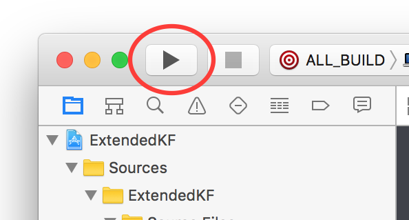
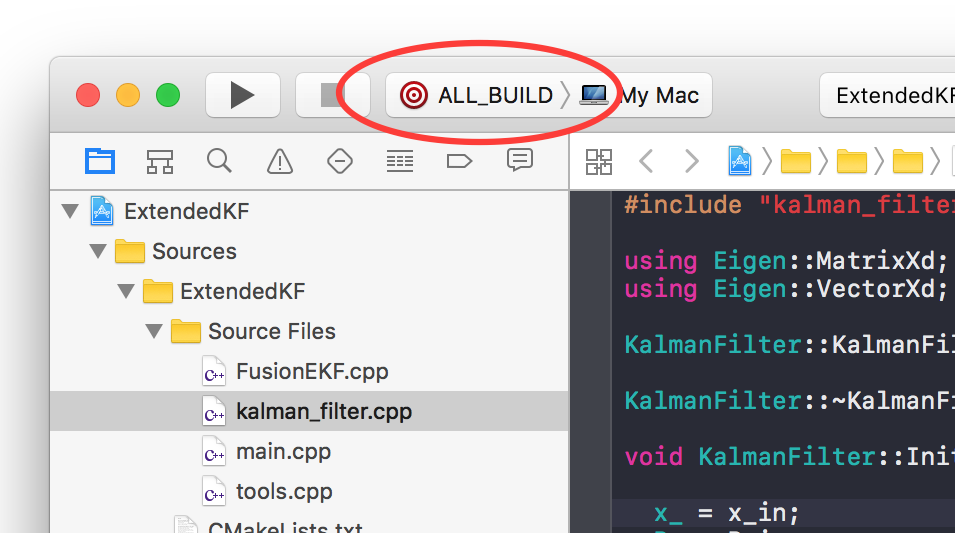
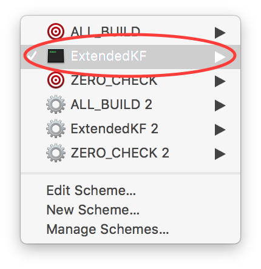
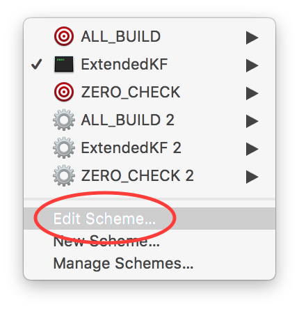
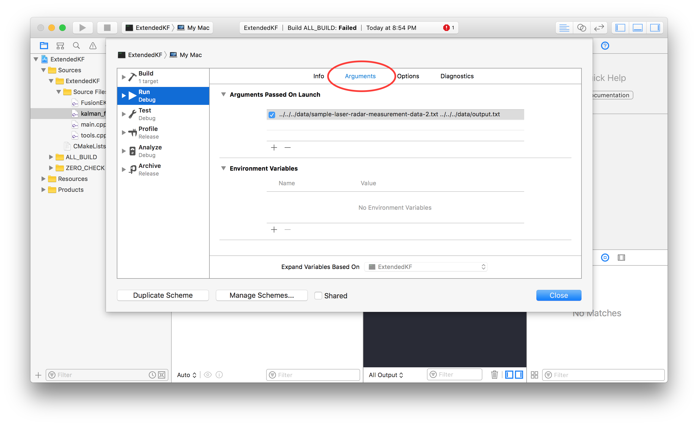
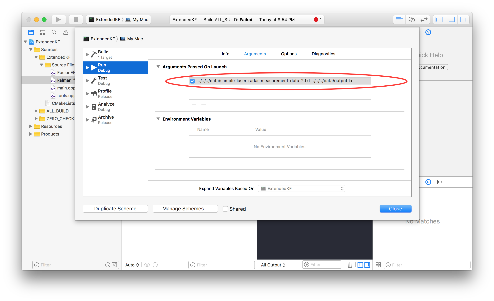
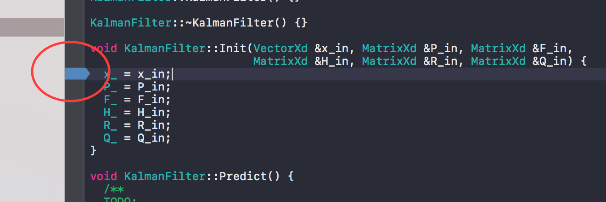
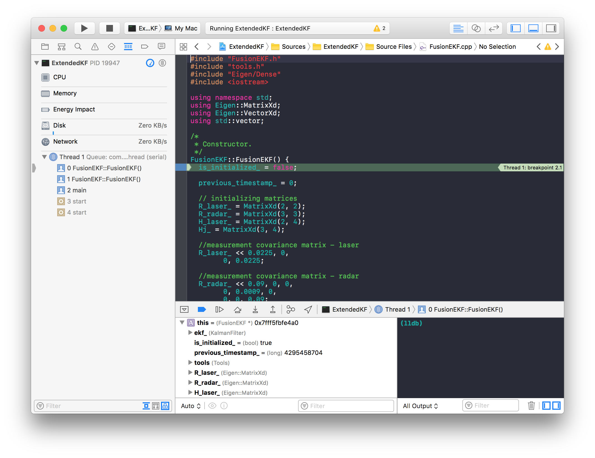

## Xcode IDE profile

### Where is Xcode IDE profile?

You will generate one! Because IDE profiles can contain paths specific to your machine, we think the best way to get an Xcode IDE profile for this project is to generate one using `cmake`. Don't worry, it is really easy.

## How to generate Xcode IDE profile?

First, you need to install `cmake`. One way to do it is through downloading "CMake" app on the [cmake website](https://cmake.org/download/). Choose a version for "Mac OSX". After your download is complete, you can drag and drop "CMake" app to your "Applications" folder.

Then you would need to add `cmake` to a command line. To do so for the current session, execute the following command: `PATH="/Applications/CMake.app/Contents/bin":"$PATH"`.

Finally, to generate Xcode IDE profile, execute the following command in the current directory: `cmake -G "Xcode" ../..`. You will need to have cmake installed first to achieve this.

```
MacBook-Pro:xcode denyskrut$ PATH="/Applications/CMake.app/Contents/bin":"$PATH"
MacBook-Pro:xcode denyskrut$ cmake -G "Xcode" ../..
-- The C compiler identification is AppleClang 8.0.0.8000042
-- The CXX compiler identification is AppleClang 8.0.0.8000042
-- Check for working C compiler: /Applications/Xcode.app/Contents/Developer/Toolchains/XcodeDefault.xctoolchain/usr/bin/clang
-- Check for working C compiler: /Applications/Xcode.app/Contents/Developer/Toolchains/XcodeDefault.xctoolchain/usr/bin/clang -- works
-- Detecting C compiler ABI info
-- Detecting C compiler ABI info - done
-- Detecting C compile features
-- Detecting C compile features - done
-- Check for working CXX compiler: /Applications/Xcode.app/Contents/Developer/Toolchains/XcodeDefault.xctoolchain/usr/bin/clang++
-- Check for working CXX compiler: /Applications/Xcode.app/Contents/Developer/Toolchains/XcodeDefault.xctoolchain/usr/bin/clang++ -- works
-- Detecting CXX compiler ABI info
-- Detecting CXX compiler ABI info - done
-- Detecting CXX compile features
-- Detecting CXX compile features - done
-- Configuring done
-- Generating done
-- Build files have been written to: /Users/denyskrut/Documents/Extended-Kalman-Filter/ide_profiles/xcode
```

### How to build using Xcode IDE profile?

After you have generated Xcode IDE profile using previous step, you should be able to find and open `ExtendedKF.xcodeproj` in the current directory. After that you can press big "Run" button on the top left to build.



### How to debug using Xcode IDE profile?

1. Click on the "ALL_BUILD" Scheme on the top left. Dropdown with Schemes will open.



2. Select "ExtendedKF" in the dropdown.



2. Open the dropdown again and select "Edit Scheme...".



3. Open "Arguments" tab.



4. Add new item to the "Arguments passed on launch" section: `../../../data/sample-laser-radar-measurement-data-1.txt ../../../data/output.txt`. This would be the parameters that you pass to your program. You can edit it later on, to test for different set of inputs.



5. Put a breakpoint in the section of the code that you expect to execute.



6. Click "Run" on the top left. After these steps you should find your program stopped under debugger.



### How to output contents of the Eigen object?

Use the following command:

```
(lldb) expr R_laser_.m_storage.m_data[0,0]
(double) $23 = 0.022499999999999999
```

This will output contents of the `R_laser_` matrix at index `0, 0`.
